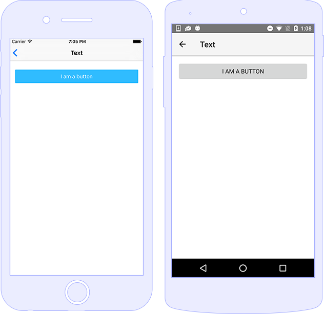

## Add New Component Category

 - Create a new directory inside the `app` directory with the name of the component, for example `action-bar`. The name of the directory will be prettified and will become the component section header. Create a file named `overview.md` and place the general overview text for the component. You **cannot** use code snippets here. 

## Add New Example

 - Create a new directory inside a component directory, for example inside the `button` directory. The name of the directory will be prettified and will become the example header, i.e. title. For example, if your directory name is `tap-event` the header will become `Tap Event`, that is, all dashes will be replaced with spaces and all the words will be capitalized.
 - Create a file named `article.md`. Place the article text and code snippet placeholders there. You can place code snippets in TypeScript, HTML and CSS. The code snippet placeholder syntax is explained [here](https://github.com/NativeScript/markdown-snippet-injector). Here is a sample article.md file:

######article.md
```
Set text in HTML
<snippet id='button-text-html'/>

Set text in code
<snippet id='button-text-code'/>
```
 - Add your example source code files, i.e. `.ts`, `.html`, and `.css` files. These files should contain the actual code snippets to be injected in `article.md`. For example:

######text.component.html
```
<StackLayout exampleTitle toggleNavButton>
    <StackLayout  class="example-container">
        <!-- >> button-text-html -->
        <Button id="button" text="I am a button"></Button>
        <!-- << button-text-html -->
    </StackLayout>
</StackLayout>
```

######text.component.ts
```
import { Component } from "@angular/core";
import { COMMON_DIRECTIVES } from '../../directives';
import { Button } from "ui/button";
import { Page } from "ui/page";

@Component({
    selector: 'button-component',
    directives: [COMMON_DIRECTIVES],
    templateUrl: 'button/text/text.component.html'
})

export class ButtonTextComponent {
}
```
 - (Optional) Make а screenshot of your example named `image.png` and add it to the example directory. Here is an image with android and ios phone screenshots:

|Image|
|---|
||

 - Finally, add your example to the main navigation list:

######app/examples-list.component.ts
```
var mainMenuLinks = [
    new Link("ActionBar", "/actionBarExamplesComponent"),
    ...
];
```
######app/app.routes.ts
```
export const routes: RouterConfig = [
    routeEntry({ path: "", component: ExamplesListComponent, data: { title: "NativeScript SDK Examples" } }),
    routeEntry({ path: "actionBarExamplesComponent", component: ActionBarExamplesComponent, data: { title: "ActionBar" } }),
];
```

 - Tests - for the time being the tests will be provided by the NativeScript QA team when the PR is accepted.

## Run Application
```
npm install
tns run android
```
or
```
npm install
tns run ios
```

## Build Article
```
npm run build
```
You can find the build results in the `dist` directory.

## Show Preview 
To see a GitHub Flavored Markdown preview of the article, execute the following command:
```
npm run show-preview
``` 

Your default browser will open [this](https://github.com/NativeScript/nativescript-sdk-examples-preview/).

This command pushes to github.com using SSH, so you might need [generate a new SSH key and add it to the ssh-agent](https://help.github.com/articles/generating-a-new-ssh-key-and-adding-it-to-the-ssh-agent/) in case you haven't done so already.

## Bugs, issues and enhancements
https://github.com/NativeScript/nativescript-sdk-examples-ng/issues
